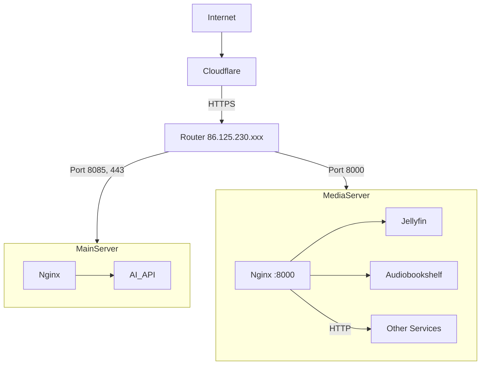

# Network Architecture and Services

## Network Overview

We have two servers in our network:

### Main Server (192.168.0.xxx)
- Primary domain: robotfun.ro
- Running Nginx for AI API services
- Port forwarding from router:
  - Port 8085 → 192.168.0.xxx:8085
  - Port 443 → 192.168.0.xxx:443

### Media Server (192.168.0.xxx)
- Running multiple Docker containers:
  - Jellyfin (Media streaming)
  - Audiobookshelf (Audiobook server)
  - Radarr (Movie management)
  - Sonarr (TV Show management)
  - Readarr (Book management)
  - qBittorrent (Download client)
- Local Nginx reverse proxy for handling external access
- Port forwarding from router:
  - Port 8000 → 192.168.0.xxx:8000 (Nginx reverse proxy)
  - Port 80 reserved for other services

## Current Setup



## Port Configuration

### Media Server (192.168.0.xxx)
- Nginx Reverse Proxy: 8000 (external access)
- Internal Services:
  - Jellyfin: 8096
  - Audiobookshelf: 13378
  - Radarr: 7878
  - Sonarr: 8989
  - Readarr: 8787
  - qBittorrent: 8080

## Domain Configuration

- Main domain: robotfun.ro → 192.168.0.xxx
- Media subdomains (through Nginx on port 8000):
  - video.robotfun.ro → Jellyfin
  - audiobooks.robotfun.ro → Audiobookshelf

## Traffic Flow

1. **External User Access**:
   ```mermaid
   sequenceDiagram
       User->>Cloudflare: HTTPS request (443)
       Cloudflare->>Router: HTTP request (8000)
       Router->>MediaServer: Forward to 192.168.0.xxx:8000
       MediaServer->>Service: Internal routing
   ```

2. **Security Implementation**:
   - All external traffic proxied through Cloudflare
   - SSL/TLS handled by Cloudflare (Flexible mode)
   - Internal traffic uses HTTP
   - Host-based routing in Nginx
   - Default server returns 444 for undefined hosts

## Cloudflare Configuration

- Free tier account
- DNS Records:
  - A record: robotfun.ro → 86.125.230.xxx
  - A record: video.robotfun.ro → 86.125.230.xxx
  - A record: audiobooks.robotfun.ro → 86.125.230.xxx
- SSL/TLS: Flexible mode
  - HTTPS between users and Cloudflare
  - HTTP between Cloudflare and origin
- Transform Rules:
  - Match: video.robotfun.ro and audiobooks.robotfun.ro
  - Set destination port: 8000
- All records proxied through Cloudflare

## Nginx Configuration

1. **Port Configuration**:
   - Listens on port 8000
   - Virtual hosts for each subdomain
   - Default server block returns 444

2. **Proxy Settings**:
   - Cloudflare IP ranges whitelisted
   - Real IP preserved through CF-Connecting-IP
   - Proper headers forwarded to services

3. **Security Headers**:
   - X-Frame-Options
   - X-XSS-Protection
   - X-Content-Type-Options
   - Referrer-Policy
   - Content-Security-Policy

## Maintenance Procedures

1. **Regular Updates**:
   - Docker containers
   - Nginx configurations
   - Security headers
   - Cloudflare IP ranges

2. **Monitoring**:
   - Nginx access and error logs
   - Docker container logs
   - Cloudflare analytics

3. **Backup Strategy**:
   - Configuration files
   - Docker volumes
   - Media files
   - Database dumps

## Troubleshooting Guide

1. **Connection Issues**:
   - Check Cloudflare proxy status
   - Verify port forwarding (8000)
   - Check Nginx logs
   - Verify Docker container status

2. **SSL Issues**:
   - Verify Cloudflare SSL mode
   - Check Nginx headers
   - Verify Cloudflare rules

3. **Performance Issues**:
   - Monitor Nginx timeouts
   - Check Docker resource usage
   - Review Cloudflare analytics 
